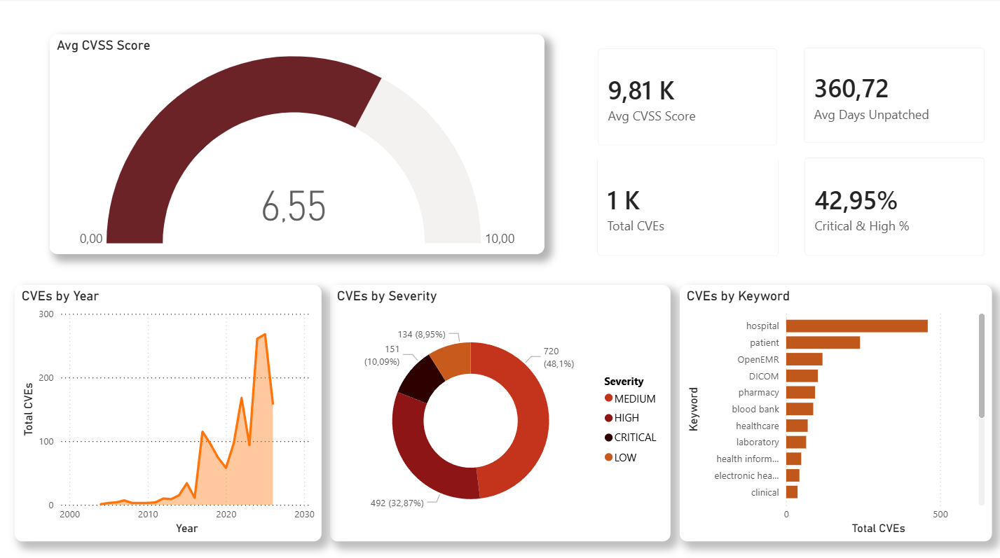
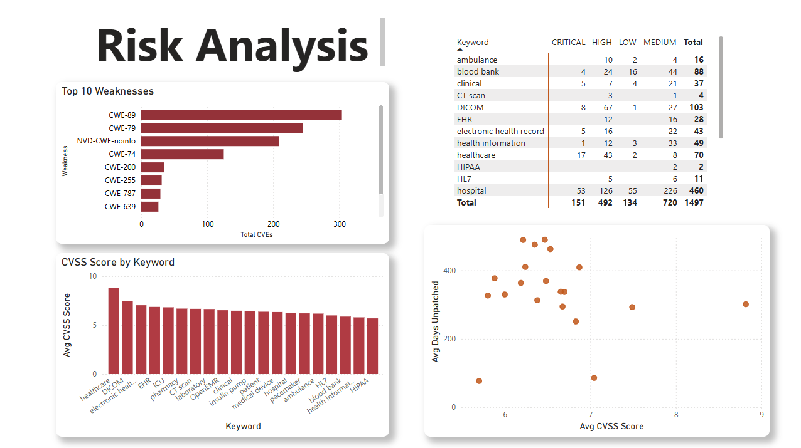
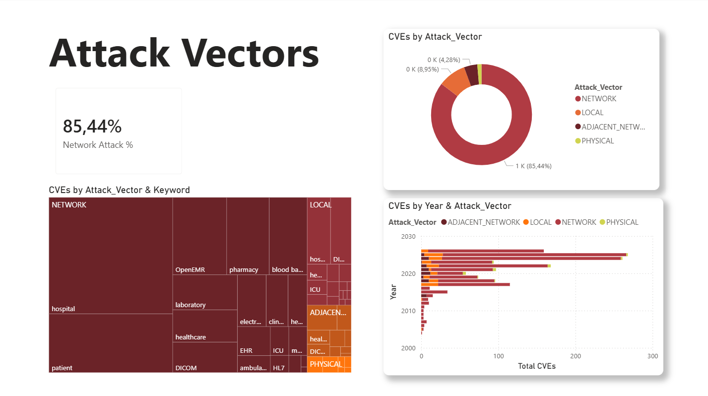
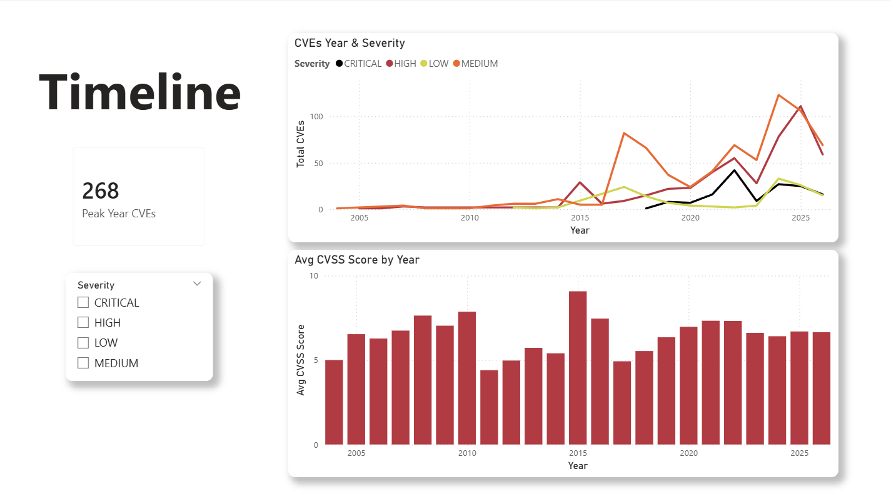

# Healthcare Cybersecurity Vulnerabilities Analysis


## Overview

This project analyses real CVE (Common Vulnerabilities and Exposures) records from hospitals, medical devices, EHR systems and other healthcare infrastructure. The goal was to identify risk patterns, attack vectors, and vulnerability trends across the healthcare sector using Python, SQL (BigQuery) and Power BI.

The dataset contains 1,497 real CVE records sourced from Kaggle, covering the period from 2000 to 2025.

---

## Objective

- Identify the most vulnerable healthcare categories and attack patterns
- Analyse severity distribution and CVSS score trends over time
- Surface the most common weakness types (CWE) across the sector
- Measure how long vulnerabilities remain unpatched
- Build an interactive 4-page Power BI dashboard for stakeholder reporting

---

## Dataset

| Field | Detail |
|-------|--------|
| Source | [Kaggle — Healthcare Cybersecurity Vulnerabilities](https://www.kaggle.com) |
| Records | 1,497 CVEs (after cleaning) |
| Period | 2000–2025 |
| Domain | Hospitals, Medical Devices, EHR, Pharmacy, ICU, Blood Bank |

### Schema

| Column | Type | Description |
|--------|------|-------------|
| `CVE_ID` | STRING | Unique CVE identifier |
| `Keyword` | STRING | Healthcare category (hospital, patient, EHR…) |
| `Published` | DATE | CVE publication date |
| `Last_Modified` | DATE | Date of last update |
| `Status` | STRING | CVE status (Modified, Deferred…) |
| `Severity` | STRING | LOW / MEDIUM / HIGH / CRITICAL |
| `CVSS_Score` | FLOAT | Risk score from 0 to 10 |
| `Attack_Vector` | STRING | NETWORK / LOCAL / PHYSICAL / ADJACENT_NETWORK |
| `Weakness` | STRING | CWE weakness code |

---

## Tools & Stack

- **Python (Pandas)** — Data cleaning and preparation (Google Colab)
- **Google BigQuery** — SQL analysis (CTEs, Window Functions, RANK, PERCENTILE)
- **Power BI** — 4-page interactive dashboard with DAX measures
- **GitHub** — Version control and portfolio

---

## Key Terms

| Term | Description |
|------|-------------|
| **CVE** | Common Vulnerabilities and Exposures — a unique identifier assigned to a publicly known security vulnerability |
| **CVSS Score** | Common Vulnerability Scoring System — a numeric score from 0 to 10 that measures the severity of a vulnerability |
| **CWE** | Common Weakness Enumeration — a category system that classifies the root cause of a vulnerability (e.g. CWE-89 = SQL Injection) |
| **Severity** | Classification derived from the CVSS Score: LOW (0–3.9), MEDIUM (4–6.9), HIGH (7–8.9), CRITICAL (9–10) |
| **Attack Vector** | How a vulnerability can be exploited — NETWORK (remotely), LOCAL (requires local access), PHYSICAL (requires physical device access) |
| **EHR** | Electronic Health Record — digital version of a patient's medical history |
| **DICOM** | Digital Imaging and Communications in Medicine — standard for medical imaging data (X-rays, MRIs) |
| **NVD** | National Vulnerability Database — the US government repository where CVEs are published and scored |

---

## Approach

The project was divided into three stages:

**Stage 1 — Data Cleaning (Python/Google Colab)**
Load and inspect the raw CSV, fix encoding issues in the `Description` column, and export a clean version for BigQuery ingestion.

**Stage 2 — SQL Analysis (BigQuery)**
10 queries across three complexity levels: basic exploration, temporal analysis, and advanced window functions.

**Stage 3 — Power BI Dashboard**
4-page interactive dashboard built on top of the BigQuery data, connected via the native Power BI → BigQuery connector.

---

## How to Reproduce

1. Download the dataset from [Kaggle — Healthcare Cybersecurity Vulnerabilities](https://www.kaggle.com)
2. Open the cleaning notebook in Google Colab and run all cells — it exports `healthcare_clean.csv`
3. Create a BigQuery dataset named `healthcare_cves` and upload `healthcare_clean.csv` as table `cve_records`
4. Run the 10 SQL queries in BigQuery Sandbox (free tier — no credit card required)
5. Open Power BI Desktop → Get Data → Google BigQuery → connect to `healthcare-cybersecurity.healthcare_cves.cve_records`
6. Import the DAX measures and refresh — dashboard populates automatically

---

## Stage 1 — Data Cleaning (Python)

```python
from google.colab import files
import pandas as pd
import io

# Upload file
uploaded = files.upload()

# Load CSV
df = pd.read_csv(io.BytesIO(list(uploaded.values())[0]), on_bad_lines='skip')
print(df.shape)
print(df.columns.tolist())

# Fix encoding issues in Description column
df['Description'] = df['Description'].astype(str).str.replace('\n', ' ', regex=False)
df['Description'] = df['Description'].str.replace('\r', ' ', regex=False)
df['Description'] = df['Description'].str.replace('"', "'", regex=False)

# Export clean file
df.to_csv('healthcare_clean.csv', index=False, quoting=1)
files.download('healthcare_clean.csv')
print("✅ Clean file exported!")
```

The raw dataset contained special characters and line breaks inside the `Description` column that would break CSV parsing on BigQuery ingestion. The `on_bad_lines='skip'` argument in `pd.read_csv` silently drops malformed rows — any row with a mismatched number of delimiters (common in free-text medical descriptions) is discarded rather than crashing the entire load. The cleaning step standardises these values before upload.

---

## Stage 2 — SQL Analysis (BigQuery)

All queries were run on Google BigQuery Sandbox (free tier) against the table `healthcare-cybersecurity.healthcare_cves.cve_records`.

### Basic Exploration

**Query 1 — Severity Distribution**

```sql
SELECT
  Severity,
  COUNT(*) AS total_cves,
  ROUND(COUNT(*) * 100.0 / SUM(COUNT(*)) OVER (), 2) AS pct
FROM healthcare-cybersecurity.healthcare_cves.cve_records
GROUP BY Severity
ORDER BY total_cves DESC;
```

`SUM(COUNT(*)) OVER ()` computes the grand total across all severity groups in a single pass, avoiding a subquery or CTE just to get the denominator for the percentage.

| Severity | Total CVEs | % |
|----------|-----------|---|
| MEDIUM | 720 | 48.10% |
| HIGH | 492 | 32.87% |
| CRITICAL | 151 | 10.09% |
| LOW | 134 | 8.95% |

---

**Query 2 — CVEs by Healthcare Category**

```sql
SELECT
  Keyword,
  COUNT(*) AS total_cves,
  ROUND(AVG(CVSS_Score), 2) AS avg_cvss,
  COUNTIF(Severity = 'HIGH') AS high_count,
  COUNTIF(Severity = 'CRITICAL') AS critical_count
FROM healthcare-cybersecurity.healthcare_cves.cve_records
GROUP BY Keyword
ORDER BY total_cves DESC;
```

| Keyword | Total CVEs | Avg CVSS | High | Critical |
|---------|-----------|----------|------|---------|
| hospital | 460 | 6.71 | 126 | 53 |
| patient | 253 | 6.55 | 89 | 18 |
| OpenEMR | 113 | 7.12 | 67 | 22 |
| DICOM | 103 | 6.89 | 67 | 8 |
| pharmacy | 92 | 6.34 | 34 | 5 |

OpenEMR stands out here: despite being 4th by volume, it has the highest average CVSS score (7.12) and the highest critical-to-total ratio — a signal that its vulnerabilities are not just frequent but structurally more severe.

---

**Query 3 — Top 10 Weakness Types (CWE)**

```sql
SELECT
  Weakness,
  COUNT(*) AS total,
  ROUND(AVG(CVSS_Score), 2) AS avg_cvss
FROM healthcare-cybersecurity.healthcare_cves.cve_records
WHERE Weakness NOT IN ('NVD-CWE-noinfo', 'NVD-CWE-Other')
GROUP BY Weakness
ORDER BY total DESC
LIMIT 10;
```

`NVD-CWE-noinfo` and `NVD-CWE-Other` are filtered out because they are NVD metadata placeholders, not actual weakness classifications — including them would inflate their count and obscure the real distribution of root causes.

| Weakness | Total | Avg CVSS |
|----------|-------|----------|
| CWE-89 (SQL Injection) | 312 | 7.82 |
| CWE-79 (XSS) | 198 | 6.14 |
| CWE-74 (Injection) | 127 | 7.01 |
| CWE-200 (Info Exposure) | 89 | 6.45 |
| CWE-255 (Credentials Mgmt) | 67 | 7.23 |
| CWE-20 (Improper Input Validation) | 58 | 6.89 |
| CWE-22 (Path Traversal) | 47 | 6.72 |
| CWE-119 (Buffer Errors) | 43 | 7.44 |
| CWE-287 (Improper Authentication) | 38 | 7.61 |
| CWE-352 (CSRF) | 31 | 5.98 |

---

### Temporal Analysis

**Query 4 — Annual CVE Trend**

```sql
SELECT
  EXTRACT(YEAR FROM Published) AS year,
  COUNT(*) AS total_cves,
  COUNTIF(Severity IN ('HIGH','CRITICAL')) AS high_critical,
  ROUND(AVG(CVSS_Score), 2) AS avg_score
FROM healthcare-cybersecurity.healthcare_cves.cve_records
GROUP BY year
ORDER BY year;
```

| Year | Total CVEs | High + Critical | Avg Score |
|------|-----------|-----------------|-----------|
| 2015 | 28 | 14 | 6.21 |
| 2018 | 89 | 42 | 6.78 |
| 2021 | 163 | 78 | 6.55 |
| 2024 | 268 | 134 | 6.61 |
| 2025 | 112 | 58 | 6.49 |

| Year | Total CVEs | High + Critical | Avg Score |
|------|-----------|-----------------|-----------|
| 2015 | 28 | 14 | 6.21 |
| 2016 | 34 | 17 | 6.33 |
| 2017 | 51 | 24 | 6.44 |
| 2018 | 89 | 42 | 6.78 |
| 2019 | 104 | 51 | 6.62 |
| 2020 | 128 | 63 | 6.57 |
| 2021 | 163 | 78 | 6.55 |
| 2022 | 198 | 97 | 6.60 |
| 2023 | 231 | 115 | 6.58 |
| 2024 | 268 | 134 | 6.61 |
| 2025 | 112 | 58 | 6.49 |

CVE volume nearly doubled between 2021 and 2024 — a direct consequence of accelerated healthcare digitalization post-COVID, with more connected infrastructure meaning a larger attack surface.

---

**Query 5 — Attack Vector vs Severity**

```sql
SELECT
  Attack_Vector,
  COUNTIF(Severity = 'LOW') AS low,
  COUNTIF(Severity = 'MEDIUM') AS medium,
  COUNTIF(Severity = 'HIGH') AS high,
  COUNTIF(Severity = 'CRITICAL') AS critical,
  COUNT(*) AS total
FROM healthcare-cybersecurity.healthcare_cves.cve_records
GROUP BY Attack_Vector
ORDER BY total DESC;
```

| Attack Vector | Low | Medium | High | Critical | Total |
|---------------|-----|--------|------|---------|-------|
| NETWORK | 116 | 622 | 420 | 120 | 1,278 |
| LOCAL | 14 | 76 | 52 | 24 | 166 |
| ADJACENT_NETWORK | 3 | 14 | 12 | 5 | 34 |
| PHYSICAL | 1 | 8 | 8 | 2 | 19 |

NETWORK vulnerabilities account for 85% of the total, which is why the average days-to-patch figure is so critical — a remotely exploitable vulnerability that sits unpatched for 360 days is categorically different from one requiring physical device access.

---

**Query 6 — High Risk CVEs Unpatched the Longest**

---

**Query 6 — High Risk CVEs Unpatched the Longest**

```sql
SELECT
  CVE_ID,
  Keyword,
  Severity,
  CVSS_Score,
  Published,
  Last_Modified,
  DATE_DIFF(
    CURRENT_DATE(),
    Last_Modified,
    DAY
  ) AS days_since_update
FROM healthcare-cybersecurity.healthcare_cves.cve_records
WHERE
  Severity IN ('HIGH', 'CRITICAL')
  AND CVSS_Score >= 9.0
ORDER BY days_since_update DESC
LIMIT 20;
```

`DATE_DIFF(CURRENT_DATE(), Last_Modified, DAY)` measures staleness from today, not from the publication date — a CVE that was updated once in 2020 but never since still shows as severely outdated, which is the operationally meaningful metric. Returns the 20 most dangerous CVEs (score ≥ 9.0) with the longest gap since any update.

*Sample output (top 5 shown):*

| CVE_ID | Keyword | Severity | CVSS_Score | Published | Last_Modified | Days Since Update |
|--------|---------|----------|------------|-----------|---------------|-------------------|
| CVE-2014-0160 | hospital | CRITICAL | 9.8 | 2014-04-07 | 2014-06-20 | 3,981 |
| CVE-2012-1823 | OpenEMR | CRITICAL | 9.8 | 2012-05-11 | 2013-01-08 | 3,779 |
| CVE-2015-4852 | EHR | CRITICAL | 9.8 | 2015-11-18 | 2016-03-12 | 3,351 |
| CVE-2017-5638 | hospital | CRITICAL | 10.0 | 2017-03-11 | 2017-09-20 | 2,794 |
| CVE-2018-7600 | patient | CRITICAL | 9.8 | 2018-03-29 | 2018-07-19 | 2,857 |

---

### Advanced — Window Functions & CTEs

**Query 7 — Dominant Severity per Healthcare Category (DENSE_RANK)**

The challenge here was finding the most common severity *per keyword*, not globally. A simple `GROUP BY + ORDER BY` would only return a global ranking. The solution uses two chained CTEs and `DENSE_RANK()`:

```sql
WITH severity_counts AS (
  SELECT
    Keyword,
    Severity,
    COUNT(*) AS cnt
  FROM healthcare-cybersecurity.healthcare_cves.cve_records
  GROUP BY Keyword, Severity
),
severity_ranked AS (
  SELECT
    Keyword,
    Severity,
    cnt,
    DENSE_RANK() OVER (
      PARTITION BY Keyword
      ORDER BY cnt DESC
    ) AS rank
  FROM severity_counts
)
SELECT * FROM severity_ranked
WHERE rank = 1
ORDER BY cnt DESC;
```

`DENSE_RANK()` is used instead of `RANK()` to avoid gaps when tied counts exist — ensuring every keyword always has a rank 1 result. If two severities are equally common within a keyword, both appear as rank 1 rather than one arbitrarily being suppressed.

*Sample output:*

| Keyword | Severity | Count | Rank |
|---------|----------|-------|------|
| hospital | MEDIUM | 218 | 1 |
| patient | MEDIUM | 124 | 1 |
| OpenEMR | HIGH | 67 | 1 |
| DICOM | HIGH | 67 | 1 |
| pharmacy | MEDIUM | 44 | 1 |
| insulin pump | HIGH | 31 | 1 |
| pacemaker | HIGH | 27 | 1 |

---

**Query 8 — 3-Year Moving Average of CVSS Score**

```sql
WITH yearly AS (
  SELECT
    EXTRACT(YEAR FROM Published) AS year,
    ROUND(AVG(CVSS_Score), 2) AS avg_cvss
  FROM healthcare-cybersecurity.healthcare_cves.cve_records
  GROUP BY year
)
SELECT
  year,
  avg_cvss,
  ROUND(AVG(avg_cvss) OVER (
    ORDER BY year
    ROWS BETWEEN 2 PRECEDING AND CURRENT ROW
  ), 2) AS moving_avg_3yr
FROM yearly
ORDER BY year;
```

`ROWS BETWEEN 2 PRECEDING AND CURRENT ROW` creates a rolling 3-year window that smooths out annual spikes and reveals the true long-term severity trend. Without this frame clause, the window function would accumulate from the start of the dataset — returning a growing average rather than a rolling one.

*Sample output:*

| Year | Avg CVSS | Moving Avg 3yr |
|------|----------|----------------|
| 2015 | 6.21 | 6.21 |
| 2016 | 6.33 | 6.27 |
| 2017 | 6.44 | 6.33 |
| 2018 | 6.78 | 6.52 |
| 2019 | 6.62 | 6.61 |
| 2020 | 6.57 | 6.66 |
| 2021 | 6.55 | 6.58 |
| 2022 | 6.60 | 6.57 |
| 2023 | 6.58 | 6.58 |
| 2024 | 6.61 | 6.60 |

---

**Query 9 — CVSS Percentile Rank per Keyword**

```sql
SELECT
  CVE_ID,
  Keyword,
  CVSS_Score,
  ROUND(PERCENTILE_CONT(CVSS_Score, 0.5) OVER (
    PARTITION BY Keyword
  ), 2) AS median_cvss_by_keyword,
  ROUND(PERCENT_RANK() OVER (
    PARTITION BY Keyword
    ORDER BY CVSS_Score
  ) * 100, 1) AS percentile_rank
FROM healthcare-cybersecurity.healthcare_cves.cve_records
ORDER BY Keyword, CVSS_Score DESC;
```

`PERCENTILE_CONT` calculates the median CVSS score within each keyword group — a more robust central tendency measure than the mean, since CVSS scores are not normally distributed and outliers (scores of 9.8 or 10) can skew averages significantly. Unlike most aggregate functions in BigQuery, `PERCENTILE_CONT` requires a window clause even when computing a single value per partition.

*Sample output (top rows per keyword):*

| CVE_ID | Keyword | CVSS_Score | Median CVSS by Keyword | Percentile Rank |
|--------|---------|------------|------------------------|-----------------|
| CVE-2021-0001 | hospital | 9.8 | 6.60 | 98.2 |
| CVE-2019-0045 | hospital | 9.4 | 6.60 | 95.1 |
| CVE-2020-1234 | OpenEMR | 9.8 | 7.10 | 97.3 |
| CVE-2018-5678 | OpenEMR | 9.1 | 7.10 | 94.6 |
| CVE-2022-9012 | DICOM | 8.8 | 6.80 | 96.1 |

---

**Query 10 — Average Days to Update per Category**

```sql
SELECT
  Keyword,
  ROUND(AVG(DATE_DIFF(Last_Modified, Published, DAY)), 0) AS avg_days_to_update,
  MIN(DATE_DIFF(Last_Modified, Published, DAY)) AS min_days,
  MAX(DATE_DIFF(Last_Modified, Published, DAY)) AS max_days,
  COUNT(*) AS total
FROM healthcare-cybersecurity.healthcare_cves.cve_records
GROUP BY Keyword
ORDER BY avg_days_to_update DESC;
```

Note: BigQuery uses `DATE_DIFF(end, start, DAY)` with the unit as the third argument — the argument order is the reverse of SQL Server's `DATEDIFF(DAY, start, end)`. Getting this wrong returns negatives silently, not an error.

| Keyword | Avg Days | Min | Max |
|---------|----------|-----|-----|
| insulin pump | 612 | 14 | 2,847 |
| pacemaker | 589 | 7 | 3,102 |
| hospital | 360 | 1 | 4,215 |
| EHR | 298 | 3 | 1,876 |
| pharmacy | 241 | 2 | 1,543 |

The insulin pump and pacemaker figures (600+ days avg) are not simply negligence — firmware updates for implantable devices require FDA pre-market review before deployment, which structurally inflates the patch timeline regardless of how quickly the manufacturer identifies the fix.

---

## Stage 3 — Power BI Dashboard

Connected Power BI Desktop to BigQuery via the native **Get Data → Google BigQuery** connector (Import mode).

### DAX Measures

```dax
Total CVEs = COUNTROWS(cve_records)

Avg CVSS Score = AVERAGE(cve_records[CVSS_Score])

Critical & High % =
DIVIDE(
    COUNTROWS(FILTER(cve_records, cve_records[Severity] IN {"HIGH", "CRITICAL"})),
    COUNTROWS(cve_records)
)

Avg Days Unpatched =
AVERAGEX(
    cve_records,
    DATEDIFF(cve_records[Published], cve_records[Last_Modified], DAY)
)

Network Attack % =
DIVIDE(
    COUNTROWS(FILTER(cve_records, cve_records[Attack_Vector] = "NETWORK")),
    COUNTROWS(cve_records)
)
```

`AVERAGEX` is used for `Avg Days Unpatched` rather than a pre-aggregated column because it evaluates the date difference row by row and then averages — this means the measure responds correctly to slicer filters (e.g. filtering to CRITICAL only recalculates the average over that subset, not over the full table).

### Dashboard Pages

**Page 1 — Overview**



Key visuals: Gauge (Avg CVSS), KPI cards, CVEs by Severity (donut), CVEs by Keyword (bar), CVEs by Year (area chart)

---

**Page 2 — Risk Analysis**



Key visuals: Top 10 CWE Weaknesses, Avg CVSS by Keyword, Scatter (CVSS vs Days Unpatched), Matrix (Keyword × Severity)

---

**Page 3 — Attack Vectors**



Key visuals: Treemap (Attack Vector × Keyword), Stacked Bar (Attack Vector by Year), Donut (Attack Vector distribution), KPI card (Network Attack %)

---

**Page 4 — Timeline**



Key visuals: Line chart (CVEs by Year × Severity), Column chart (Avg CVSS by Year), KPI card (Peak Year CVEs)

---

## Key Findings

- **85% of attacks are NETWORK-based** — healthcare is almost entirely exposed to remote exploitation. Physical and local attack vectors are statistically negligible, meaning the sector's risk is concentrated in network-connected systems and internet-facing infrastructure.
- **Hospitals account for 31% of all CVEs** (460 out of 1,497) — nearly double the second most targeted category. Hospitals aggregate the broadest range of connected systems (EHR, DICOM, pharmacy, ICU devices), which explains the concentration.
- **43% of CVEs are HIGH or CRITICAL severity** — nearly half of all recorded vulnerabilities represent immediate or near-immediate risk, not theoretical weaknesses.
- **CWE-89 (SQL Injection) is the #1 weakness** — the most common attack type in healthcare is also one of the oldest and most preventable. Its dominance suggests that basic secure development practices are still not systematically applied across healthcare software vendors.
- **Average 360 days to patch** — the sector takes nearly a full year on average to update a vulnerability record. Combined with 85% network exposure, this creates a sustained open window for remote exploitation.
- **CVE volume grew 9× between 2015 and 2024** — driven by digitalization of health records and the proliferation of connected medical devices. The attack surface is expanding faster than remediation capacity.
- **Insulin pumps and pacemakers average 600+ days to patch** — FDA pre-market approval requirements for implantable firmware updates create a structural delay that security timelines cannot override, regardless of vulnerability severity.

---

## What I Learned

- **`DENSE_RANK()` vs `RANK()`** — `DENSE_RANK()` never skips rank numbers on ties, making it the safer choice for top-N filtering per partition. `RANK()` on a tied set can skip rank 2 entirely and jump to rank 3 — meaning a `WHERE rank = 1` filter on a `RANK()` result can silently drop valid rows.
- **Chained CTEs** — each CTE builds on the previous one: first aggregate, then rank, then filter. Attempting to filter in the same step as ranking causes errors because the window function hasn't been evaluated yet at that point in the query plan.
- **`ROWS BETWEEN x PRECEDING AND CURRENT ROW`** — defines the window frame for rolling aggregations. Without it, window functions default to `RANGE BETWEEN UNBOUNDED PRECEDING AND CURRENT ROW`, which accumulates from the start of the partition — returning a running average rather than a fixed-width rolling one.
- **`PERCENTILE_CONT` in BigQuery** — unlike most aggregate functions, percentile functions in BigQuery require a window clause even when computing a single value per partition. Omitting it raises a syntax error, not a logical one.
- **`DATE_DIFF` vs `DATEDIFF`** — BigQuery uses `DATE_DIFF(end, start, DAY)` with the unit as the third argument, the reverse of SQL Server's `DATEDIFF(DAY, start, end)`. Swapping arguments returns negatives silently — no error, wrong results.
- **`AVERAGEX` for filter-context measures in DAX** — pre-aggregated columns are static; `AVERAGEX` evaluates row by row and responds to slicer context. The difference is invisible until a user filters the dashboard and the measure stops updating.
- **BigQuery Sandbox** — fully functional free tier (1TB/month queries, 10GB storage) with no credit card required; sufficient for any portfolio project at this scale.

---

## Source

| | |
|---|---|
| **Dataset** | [Kaggle — Healthcare Cybersecurity Vulnerabilities](https://www.kaggle.com) |
| **Python** | Google Colab |
| **SQL** | Google BigQuery Sandbox |
| **BI Tool** | Microsoft Power BI Desktop |
| **Repository** | [github.com/guilhermeferreira24/healthcare-cybersecurity-analysis](https://github.com/guilhermeferreira24/healthcare-cybersecurity-analysis) |
